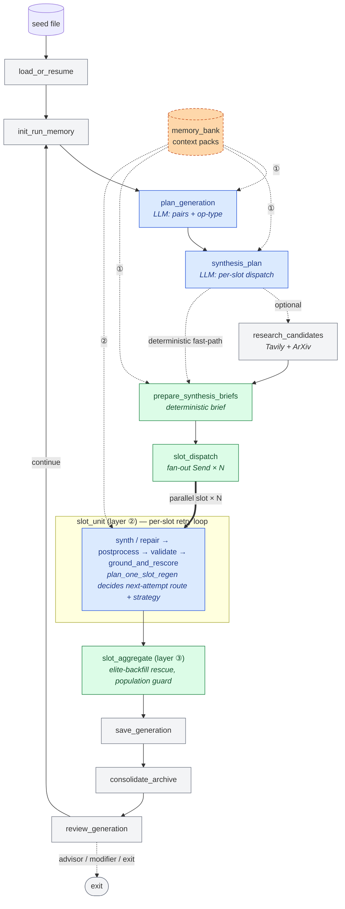

# EntropyMath Deep Agent

> **NeurIPS 2026 Evaluations & Datasets Track — anonymous code repository.** This is the executable code accompanying the paper *EntropyMath-Generated-v1: Evolutionary Generation and Validation for Auditable Mathematical Reasoning Evaluation* (under double-blind review).
>
> **Companion artifacts (separate hosting, see paper for canonical references):**
> - **Dataset (Hugging Face Datasets):** `huggingface.co/datasets/sgmlc1234/EntropyMath-Gen-v1` — 934-row release CSV/JSONL, Croissant 1.1 metadata with Responsible AI fields, packaging metadata, license.
> - **Supplementary archive (OpenReview):** frozen 120-row pre-filter and 180-row audit samples; 1,089 frozen direct-no-tool model outputs; external benchmark control/treatment JSONL arms; quality-gate clean and quarantine manifests; trace exports; per-paper-section evidence README.
>
> **Reviewer smoke test:** `./run.sh verify`, run from this repository root. It takes a few seconds and uses only the Python standard library — no dependency install, no API keys, no model calls. It checks that the runtime entry points, package layout, system prompts, and public seed schema are present and well-formed, that every shipped module parses, and that no credentials or identifying strings are embedded. The released dataset and the frozen evidence files are hosted separately (see above); their integrity checker ships with the supplementary archive, not with this repository.
>
> **Anonymity:** This repository contains no author names, institutional affiliations, internal URLs, API keys, or `.git/` history with author identity. All credential variables are referenced by name only. Private seed problems and full saved-run archives are intentionally excluded.

---

EntropyMath Deep Agent is a closed-loop math problem evolution system built around an orchestrator-centric LangGraph runtime. Starting from one or more seed problems, it plans generation-sized pools, dispatches mutation and crossover workers, validates mathematical faithfulness, and saves each accepted generation as structured artifacts.

The current public version emphasizes:
- three-layer orchestrator-centric design (generation / per-slot / cross-slot)
- generation-rooted LangSmith tracing with per-slot span nesting
- deterministic Python sandbox verification with cached execution evidence
- per-slot retry loop with strategy cycling and history-aware persistent-failure detection
- two-pass regenerability validation: solution-only reconstruction → parent-anchored rescue on drift
- a dedicated solvability gate for constraint-heavy children
- elite-backfill rescue that keeps generation population above `min_survivable_population`

## What You Need To Prepare

To run DeepAgent successfully, you need four inputs:

1. API configuration
2. a private seed dataset
3. one or more seed IDs to start from
4. a run budget such as max generations or target problem count

The repository ships the runtime and the public JSON schema, but it does **not** ship the real seed problems.

## Repository Structure

```text
repo/
├── main.py
├── config.py
├── tools.py
├── data_paths.py
├── artifact_views.py
├── requirements.txt
├── README.md
├── prompts/
│   ├── __init__.py          # prompt builders + Pydantic schemas
│   └── system/*.md          # system-prompt fragments per agent role
├── deepagent/
│   ├── graph/               # wiring (__init__.py), routing, tracing helpers
│   ├── invariants.py
│   ├── memory_bank.py
│   ├── nodes/
│   │   ├── bootstrap.py     # load_or_resume, init_run_memory
│   │   ├── planning/        # plan_generation, synthesis_plan, research, briefing
│   │   ├── synthesis/       # slot_pipeline (slot_dispatch/unit/aggregate),
│   │   │                    # generator, repair_hotfix
│   │   ├── regen/           # regen_planner + regenerate_failed_node
│   │   ├── validation/      # orchestrator (per-slot gate) + worker helpers
│   │   ├── persistence.py   # save_generation, consolidate_archive
│   │   └── review/          # review_generation, advisor, modifier, exit
│   ├── python_sandbox.py
│   ├── quality.py
│   ├── grounding.py
│   ├── state_full.py
│   └── tracing.py
├── tools/                   # offline analysis and campaign scripts (not runtime)
└── data/
    └── seed/
        └── problems.schema.json
```

The repository has two distinct parts, and only the first is exercised by a generation run:

- **Runtime.** `main.py`, `config.py`, `tools.py`, `data_paths.py`, `artifact_views.py`, `prompts/`, and `deepagent/`. These implement the generation loop itself. Note that the root module `tools.py` (sandbox execution and search helpers, imported as `from tools import ...`) is separate from the `tools/` directory below; the module shadows the directory on the import path, and the directory is never imported as a package.
- **Offline analysis.** `tools/*.py` and `tools/*.sh` are standalone scripts, each run directly as `python tools/<name>.py`. They build evaluation datasets, apply the quality gate, launch benchmark campaigns, and produce the tables and figures reported in the paper. They are not imported by the runtime and are not needed to run a generation.

Generated run outputs under `data/runs/`, persistent memory under `data/memory/`, local experiment outputs under `data/gen_problem/`, private seed assets under `data/seed/*.json`, and the internal `test/` harness are intentionally excluded from the public repository.

Implementation note:
- `deepagent/graph/` contains graph wiring and graph support modules.
- `deepagent/nodes/synthesis/generator.py` contains the active generator implementation.
- `deepagent/nodes/validation/orchestrator.py` contains validation-stage graph nodes, and `deepagent/nodes/validation/worker.py` contains reusable validation worker functions.

## Architecture

DeepAgent is **orchestrator-centric** in three nested layers. At each layer, an orchestrator owns the routing decisions and workers execute a narrow contract.

| Layer | Scope | Orchestrator owns | Workers execute |
|---|---|---|---|
| **① Generation** | one full generation | `plan_generation` (LLM: parent selection, op-type mix), `synthesis_plan` (LLM: per-slot dispatch), `prepare_synthesis_briefs` (deterministic brief build) | `research_candidates` (Tavily/ArXiv) |
| **② Per-slot** | inside `slot_unit`, one slot's retry loop | `plan_one_slot_regen` (LLM + sanitizer: route, strategy cycling, giveup), internal phase sequencing | generator, repair hotfixes, code sandbox |
| **③ Cross-slot** | `slot_aggregate` | elite-backfill selection, population guard, peer-context stitching | — |

Memory bank is a first-class cross-cutting input: built once per generation, it feeds all three orchestrator layers rather than being consulted only at one stage.



Legend: 🟦 LLM-orchestrated decision · 🟩 deterministic orchestration · ⬜ worker execution · 🟧 memory (cross-cutting input).

Key runtime behaviors:
- Start from arbitrary seed count; converge to a fixed target generation size.
- **Per-slot retry stays inside `slot_unit`** — each slot runs synth → postprocess → validate → ground with its own retry budget; there is no cross-slot retry round.
- After per-slot retries exhaust, `slot_aggregate` fires elite-backfill immediately rather than looping through another generation-level retry.
- Regenerability validation is a **two-pass gate**: a 1st-pass reconstruction-based check is followed, on drift-pattern hard fails, by a parent-anchored 2nd pass that rescues validator-side false positives.
- Repair strategies **cycle** through the four canonical hotfixes (`full_regenerate`, `code_only_hotfix`, `target_only_hotfix`, `statement_domain_hotfix`) — the orchestrator refuses to re-recommend a strategy already tried on the slot.
- Non-interactive review stays inside the generation trace instead of spawning separate top-level review roots.

## Validation Stack

The validator runs an ordered stack of gates inside `slot_unit`:

1. **Missing-field / axis-missing signal** — fast-fail if required fields are empty.
2. **Code gate** — deterministic Python sandbox execution; code must produce the claimed answer.
3. **Near-copy detection** — statement similarity ≥ 0.85 with identical answer is blocked.
4. **Constraint-guard (invariant audit)** — deterministic check that named definitions and core relations are preserved.
5. **Solvability gate** — slot-level feasibility probe for constraint-heavy non-survivors (integer/natural-number equation systems, symmetric power-sum / Newton-sum systems, derived-constant coupling). Unsupported families are skipped; supported failures route back via `solvability_replan`.
6. **Regenerability validation (1st pass)** — reconstruct the problem from `solution + answer` alone and compare semantically to the candidate statement.
7. **Parent-anchored retry (2nd pass)** — triggered when the 1st pass emits `hard_fail` with a drift-pattern reason. Compares the candidate against the *parent* problem directly; pass / advisory-fail on the 2nd pass override the 1st-pass hard fail.
8. **Ground and rescore** — difficulty rescoring + adversarial probes.
9. **Quality assessment** — advisory only, surfaces triviality / novelty concerns without blocking.

## Tracing

Tracing is generation-rooted in LangSmith:
- `deepagent.generation.1`
- `deepagent.generation.2`
- `deepagent.generation.3`

Node-level traces for stages such as `research_candidates`, `prepare_synthesis_briefs`, `repair_failed_candidates`, `postprocess_candidates`, and `validate_candidates` remain nested under the active generation root. Optional stages are skipped entirely for deterministic fast-path slots, which keeps traces shorter and easier to inspect.

Required environment:

```bash
LANGSMITH_TRACING=true
LANGSMITH_PROJECT=entropymath
LANGSMITH_API_KEY=...
```

## Installation

```bash
cd /path/to/entropymath/repo
python3 -m venv .venv
./.venv/bin/pip install -r requirements.txt
```

## Environment Setup

Create a local `.env` file or export the variables directly:

```bash
OPENROUTER_API_KEY=...
TAVILY_API_KEY=...
LANGSMITH_TRACING=true
LANGSMITH_PROJECT=entropymath
LANGSMITH_API_KEY=...
```

Notes:
- `OPENROUTER_API_KEY` is required.
- `TAVILY_API_KEY` is optional but strongly recommended for open-ended crossover research.
- LangSmith is optional for local experimentation, but recommended for debugging and production tracing.

## Seed Input Format

The public schema is at `data/seed/problems.schema.json`.

Your private seed file must be a JSON array of problem objects. In practice each seed should include at least:
- `id`
- `statement`
- `answer`
- `solution`
- `difficulty`

Minimal example:

```json
[
  {
    "id": "AC-1",
    "statement": "Let p be a prime ... compute the trace ...",
    "answer": "36",
    "solution": "Explain the algebraic argument.",
    "difficulty": 7.5
  }
]
```

DeepAgent can read:
- a single seed file via `--seed-file`
- multiple comma-separated seed files via `--seed-file path1,path2`
- the repo-local private defaults in `data/seed/private/` when present

If you want to start from a subset, use `--seed-ids`.

## Running

### Basic run

Run a three-generation job from selected seeds:

```bash
cd /path/to/entropymath/repo
./.venv/bin/python main.py \
  --seed-file /path/to/private_seed_file.json \
  --seed-ids YOUR_ID_1,YOUR_ID_2,YOUR_ID_3 \
  --max-generations 3
```

### Multi-file seed input

```bash
./.venv/bin/python main.py \
  --seed-file /path/to/EntropyMath_seed_v1.json,/path/to/EntropyMath_seed_v2.json \
  --seed-ids AC-1,LHE-5,BSK-5 \
  --max-generations 3
```

### Resume from the latest saved generation

```bash
./.venv/bin/python main.py \
  --use-latest \
  --seed-file /path/to/EntropyMath_seed_v1.json,/path/to/EntropyMath_seed_v2.json \
  --max-generations 5
```

### Explicit artifact and generation output paths

```bash
./.venv/bin/python main.py \
  --seed-file /path/to/private_seed.json \
  --seed-ids AC-1,LHE-5,BSK-5 \
  --max-generations 3 \
  --artifact-dir /path/to/output/deep-run \
  --save-format /path/to/output/deep-run/generation_{gen}.json
```

### Interactive review mode

```bash
./.venv/bin/python main.py \
  --seed-file /path/to/private_seed.json \
  --seed-ids AC-1,LHE-5,BSK-5 \
  --max-generations 2 \
  --interactive-review
```

In interactive mode, the run pauses after `review_generation` and waits for a continue / advisor / modify / exit action.

### External ablation and new-seed expansion

Build the 20-seed-per-benchmark ablation manifests:

```bash
tools/build_ablation_seed_files.py
```

Run a matched ablation micro-study on existing seeds:

```bash
tools/launch_ablation_run.sh math500 existing_a no_near_copy 2
tools/launch_ablation_run.sh math500 existing_a no_solvability 2
```

Generate an additional 100-treatment campaign from the new 10 seeds for one benchmark:

```bash
tools/launch_new_seed_treatment_campaign.sh math500 100 10
```

Summarize completed ablation runs:

```bash
tools/analyze_ablation_microstudy.py \
  --run-dirs data/runs/<run-a> data/runs/<run-b> \
  --out-dir data/analysis/ablation_microstudy
```

## CLI Inputs Explained

The most important runtime inputs are:

- `--seed-file`
  - Absolute path to one seed JSON file, or a comma-separated list of files.
  - If omitted, DeepAgent will try repo-local private defaults under `data/seed/private/`.
- `--seed-ids`
  - Comma-separated problem IDs to use as the initial generation.
  - If omitted, all seeds from the selected file(s) are loaded.
- `--use-latest`
  - Resume from the latest saved generation matching the active `--save-format`.
- `--max-generations`
  - Maximum number of review-complete generations to run.
- `--target-generation-size`
  - Desired steady-state pool size per generation.
- `--target-problem-count`
  - Stop once cumulative validated generated problems reach this value.
- `--max-parallel-dispatch`
  - Maximum parallel worker dispatch for synthesis/research/validation.
- `--ablation-condition`
  - One of `full`, `no_near_copy`, or `no_solvability`; records gate-ablation state in run artifacts.
- `--interactive-review`
  - Pause after each saved generation for manual review.
- `--run-dir`
  - Base directory for a run.
- `--artifact-dir`
  - Directory for per-stage JSON artifacts, logs, and validated problem views.
- `--save-format`
  - Pattern for saved generation files. Must include `{gen}` if you want separate generation files.

## Typical Workflow

1. Prepare a private seed file that matches `data/seed/problems.schema.json`.
2. Pick 3-5 seed IDs from that file.
3. Run `main.py` with `--seed-file`, `--seed-ids`, and `--max-generations`.
4. Inspect the run directory under `data/runs/` or your chosen `--artifact-dir`.
5. Read:
   - `runtime.log`
   - `full_run_result.json`
   - `validated_problems/`
   - per-generation artifacts such as `000_plan_generation.json`, `000_synthesis_plan.json`, `000_postprocess_candidates.json`, and `000_validate_candidates.json`
6. If needed, rerun with `--use-latest` or with a new seed mix.

Useful options:
- `--seed-file`
- `--seed-ids`
- `--max-generations`
- `--target-generation-size`
- `--target-problem-count`
- `--max-parallel-dispatch`
- `--interactive-review`
- `--run-dir`

## Notes For Release

- `deepagent/` is the active implementation path.
- old tracked generated outputs were removed from the repository.
- real seed datasets are intentionally not public; only the JSON schema is shipped.
- local logs, runs, memory caches, private seeds, internal tests, and virtual environments are ignored via `.gitignore`.
- publication-facing documentation should reference `deepagent/`, not deprecated legacy paths.
