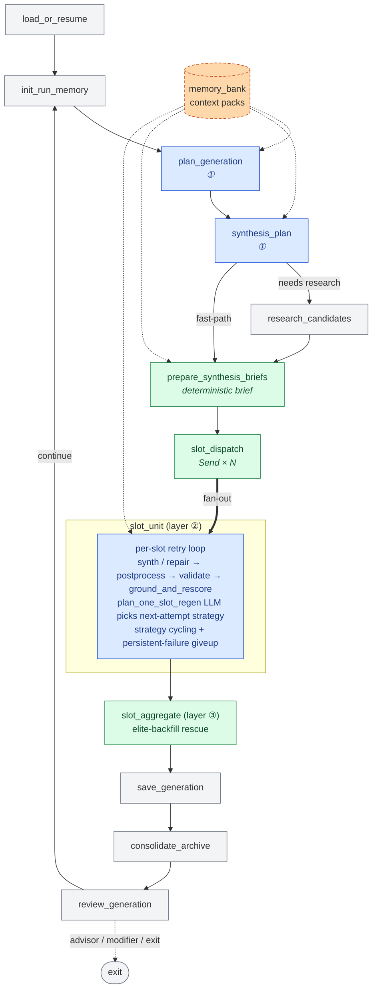
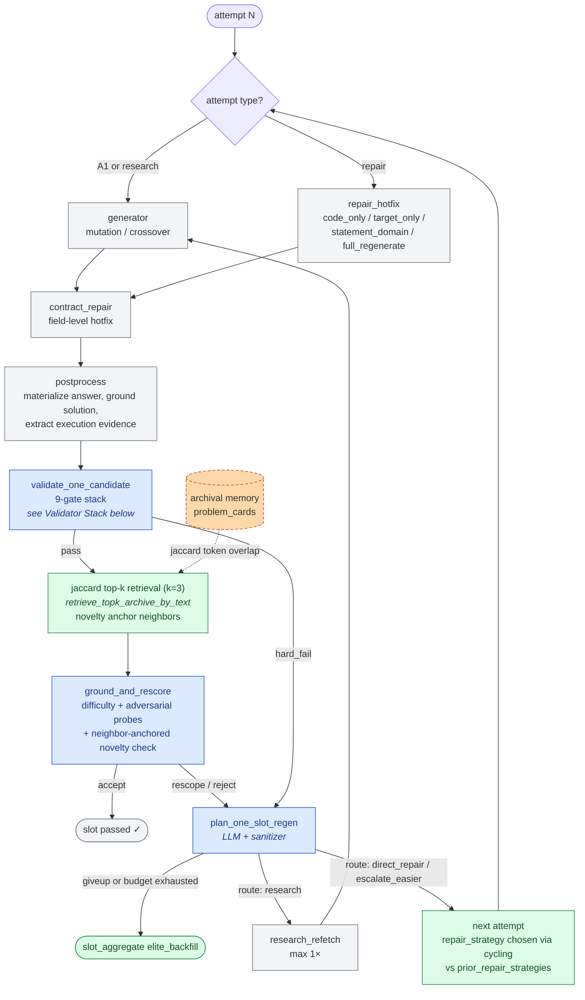
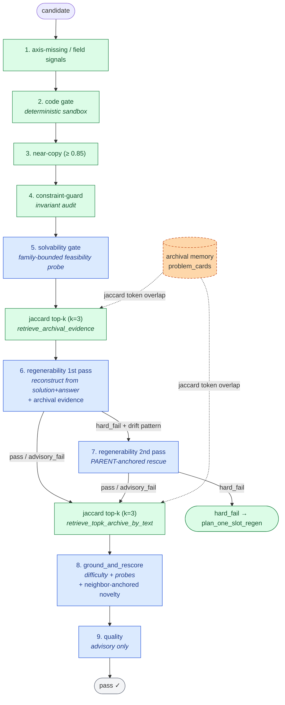

# DeepAgent Architecture

`deepagent/` contains the runtime graph, worker agents, memory layer, validation logic, and Python verification runtime for the closed-loop evolution system.

The public repository documents the runtime architecture only. Private seed corpora, run artifacts, and internal test harnesses are intentionally excluded from version control.

## Module Map

| Path | Role | Current responsibility |
|------|------|------------------------|
| `graph/` | Graph wiring | `__init__.py` assembles the LangGraph state machine; `routing.py` + `helpers.py` + `tracing` hooks |
| `tracing.py` | Tracing/runtime infra | Generation-rooted traces, slim spans, child-run helpers, parallel dispatch |
| `nodes/bootstrap.py` | Bootstrap | `load_or_resume`, `init_run_memory` |
| `nodes/planning/` | Planning orchestrator | `plan_generation`, `synthesis_plan`, `research_candidates`, deterministic `prepare_synthesis_briefs` |
| `nodes/synthesis/` | Slot fan-out | `slot_pipeline` (`slot_dispatch`/`slot_unit`/`slot_aggregate`), `generator`, `repair_hotfix` |
| `nodes/regen/` | Regen planning | `regen_planner` (sanitizer + tiebreaker rules), `regenerate_failed_node` (legacy batch path) |
| `nodes/validation/` | Validation package | per-slot `orchestrator` (gate pipeline) + shared `worker` helpers |
| `nodes/persistence.py` | Persistence | `save_generation`, `consolidate_archive` |
| `nodes/review/` | Review loop | `review_generation`, `advisor_stage`, `modifier_stage`, `exit` |
| `memory_bank.py` | Memory layer | archival cards, run working memory, context packs, retrieval |
| `python_sandbox.py` | Sandbox | fixed interpreter, runtime modes, import policy, timeouts |
| `quality.py`, `grounding.py`, `invariants.py` | Worker utilities | quality advisory, post-validate grounding probes, structural invariants |
| `state_full.py` | LangGraph state | shared state schema including memory + context fields |

## Three Orchestrator Layers

All routing decisions in DeepAgent live in one of three orchestrator layers. Workers always execute a narrow contract and never decide what comes next.

| Layer | Node(s) | Scope | LLM-driven | Deterministic |
|---|---|---|---|---|
| **①** Generation | `plan_generation`, `synthesis_plan`, `research_candidates` | one full generation | pair selection, op-type mix, per-slot variation axis | budget accounting, context-pack routing |
| **②** Per-slot | `slot_unit` (internal `plan_one_slot_regen` + `_sanitize_decision`) | one slot's retry loop | next-attempt route (research / repair / escalate / giveup), `repair_strategy_override`, `research_focus_override` | Rule -1 (survivor → giveup), Rule 0 (canonical-key persistent-failure), Rule 1a (budget + scarcity → giveup), strategy cycling, `repair_strategy_override` canonical validation |
| **③** Cross-slot | `slot_aggregate` | population guard | — | elite-backfill selection, min-survivable enforcement, peer-context stitching |

The per-slot regen LLM (`plan_one_slot_regen`) internally delegates to the batch `plan_regeneration` builder with a single-slot summary, so both paths share the same prompt contract (`regen_plan.md`) and sanitizer (`_sanitize_decision`). The `regenerate_failed_node` graph node remains registered for resume-from-legacy-session_phase paths, but is not on the hot path of the current slot fan-out architecture.

## Graph Architecture

Key properties:
- Deterministic fast-path slots skip `research_candidates` entirely; `prepare_synthesis_briefs` runs deterministically regardless.
- `slot_dispatch` emits a `Send` per non-survivor work item so `slot_unit` executes in parallel (bounded by `max_parallel_dispatch`). Survivor-only batches short-circuit directly to `slot_aggregate`.
- `slot_aggregate` has a single outgoing edge to `save_generation`. Per-slot retry is fully internal to `slot_unit`; there is no cross-slot retry round. When slots remain missing or failed after per-slot budget exhaustion, elite-backfill fires inside `slot_aggregate` and the generation saves partially.
- The `regenerate_failed` node in the graph is reachable only from the legacy `START` / `ground_and_rescore` conditional aliases kept for resuming older `session_phase` snapshots.

## Per-slot Retry Loop (inside `slot_unit`)

The retry budget (`max_slot_regen_attempts` = 4 = 1 synth + 3 repairs) lives entirely inside `slot_unit`. `plan_one_slot_regen` decides each next attempt using:
- `recent_failure_types` + `recent_failure_signatures` (canonical-key collapse via `_canonical_signature`)
- `prior_repair_strategies` (refuses to recommend a canonical strategy already tried)
- research refetch budget (`max_research_refetch` = 1)
- failure-type classification (`_IDEA_SCARCITY_FAILURE_TYPES` vs `_MECHANICAL_FAILURE_TYPES`)

Rules enforced by the sanitizer regardless of LLM output: survivor-op giveup, persistent-failure cap, budget-exhausted idea-scarcity giveup, canonical-strategy validation, strategy-repetition cycling.

## Memory System

### Long-term memory

Built once per generation in `memory_bank.py`.

Outputs:
- `memory_bank`
- `generation_memory`

Long-term memory is file-backed under `data/memory/` unless the run is explicitly marked as an ephemeral `deep-trace-*` style run.

### Memory cards

`ProblemMemoryCard` stores:
- `problem_id`
- `generation`
- `source_kind`
- `parent_ids`
- `ancestor_ids`
- `difficulty`
- `op_type`
- `invariant_signature`
- `target_signature`
- `variation_axes`
- `concept_summary`
- `decomposition_notes`
- `failure_signatures`
- `research_quality`

`GenerationMemoryCard` stores:
- diversity summary
- repeated patterns
- repeated failures
- underexplored axes
- repeated structural motifs
- underexplored family/form combinations

### Context packs

Each work item receives a separate `ContextPack` with:
- `authoritative_core`
- `lineage_context`
- `contrast_context`
- `opportunity_context`
- `research_policy`

Stage budgets are enforced independently, so orchestrator, researcher, briefer, and generator do not all receive the same payload size.

## Worker Contracts

### Selector

`nodes/planning/selector.py` plans the generation, using current candidates plus generation memory. It is responsible for:
- survivor retention
- crossover pair selection
- mutation target choice
- diversity and failure-aware planning

### Researcher

`nodes/planning/researcher.py` is a dedicated sourcing stage. It:
- follows `context_pack.research_policy`
- uses Tavily and ArXiv through tools
- treats raw search results as untrusted
- emits structured `ResearchArtifactSchema` output

### Briefing

`nodes/planning/briefing.py` converts raw research + memory into a narrow execution brief. Each brief explicitly carries:
- `target_quantity_guard`
- `concept_to_activate`
- `pattern_to_avoid`
- `generator_instructions`

The brief is authoritative. Raw research is secondary evidence.

### Generator

`nodes/synthesis/generator.py` has separate surfaces for mutation and crossover:
- different system prompts
- different structured output schemas
- different prompt builders

It also:
- emits `generation_delta_plan`
- chooses `code_runtime_mode`
- assigns lineage-readable fallback IDs
- runs a deterministic code gate before validator-stage checks

Readable fallback IDs are derived from lineage, for example:
- `cross_hard_WSJ13_JHB13`
- `mut_easy_cross_easy_LHE11_JHB13`

## Python Verification Runtime

`python_sandbox.py` normalizes execution across generator, tool, and validator paths.

Runtime modes:
- `numeric_python`
- `scientific_python`
- `symbolic_python`

Behavior:
- default interpreter is `repo/.venv/bin/python`
- import allowlists vary by mode
- banned imports and unsafe calls are rejected in preflight
- timeout profile depends on mode
- runtime errors are classified into stable error types such as:
  - `syntax_error`
  - `import_not_allowed`
  - `dependency_missing`
  - `timeout`
  - `name_error`
  - `type_error`
  - `api_misuse`
  - `runtime_error`

The generator no longer needs to waste extra tool calls on final verification. The deterministic code gate and validator reuse cached execution assessments.

## Validator Stack

Each candidate passes through an ordered gate stack inside `validate_one_candidate` ([nodes/validation/orchestrator.py](nodes/validation/orchestrator.py)), with low-level helpers in [nodes/validation/worker.py](nodes/validation/worker.py). The stack is fail-closed: any gate emitting `False` / `hard_fail` returns the slot to `plan_one_slot_regen` unless a downstream rescue (T3-a anchored retry) overrides.

### Code execution assessment

Candidate code runs in the fixed `python_sandbox` before any LLM check. The cached execution result is reused by the generator code gate, answer materialization, and validator-side checks so a given snippet never executes twice per slot.

### Near-copy detection

`assess_near_copy` blocks slots whose normalized statement similarity exceeds 0.85 with identical answer as any parent. Threshold was raised from 0.75 so parameter-level mutations that still look like their parent surface get through while true survivor-collapse chains still block.

### Constraint-guard (invariant audit)

Deterministic check against the parent invariant bundle (named definitions, core relations, forbidden rewrites, allowed variation axes). Reports structured `definition_rewrite` / `relation_rewrite` / `domain_drift` flags; `definition_rewrite` fails closed, `relation_rewrite` is advisory.

### Solvability gate

Slot-level feasibility probe for constraint-heavy non-survivors. v1 covers integer/natural-number equation systems, symmetric power-sum / Newton-sum systems, and derived-constant coupling. Unsupported families are skipped (not hard-failed); supported failures route back through `plan_one_slot_regen` with a solvability-specific failure type.

### Regenerability validation (1st + 2nd pass)

**1st pass** reconstructs the candidate from `solution + answer` alone (no parent anchor) and compares it to the candidate statement. Failure types fall into three categories:
- `domain_shift`, `target_shift`, `definition_rewrite` → hard-fail (fail-closed).
- `relation_rewrite` that preserves the logical contract → `advisory_fail` (passes the slot with a flag).
- Drift that looks like the reconstruction LLM itself wandered off-topic → hard-fail with a drift-pattern reason (`entirely unrelated`, `replaces X with Y`, `wholly different`).

**2nd pass (parent-anchored rescue)** fires on the third category. The rescue prompt shows the LLM the PARENT problem directly and asks whether the candidate preserves the parent's core task type, using a dedicated system prompt (`validator_anchored_retry.md`) that explicitly frames this as a rescue pass — be permissive on borderline variations, do not mechanically re-affirm the 1st-pass verdict. Pass / advisory-fail on the 2nd pass override the 1st-pass hard fail.

### Ground and rescore

Post-validation grounding gate: difficulty rescoring plus three adversarial probes for hidden constraints, shortcut exploits, and target-quantity drift. Before the LLM call, `retrieve_topk_archive_by_text` (Jaccard token overlap, k=3) pulls the three most similar archival problem cards and injects them as novelty anchors so the grounding LLM can judge novelty-collapse against durable history rather than only the current pool. A parallel Jaccard retrieval (`retrieve_archival_evidence`) feeds gate 6 regenerability validation with the same archival memory. Result: `accept`, `rescope`, or `reject`.

### Quality assessment

Advisory-only. Emits `novelty_low`, `too_easy_derivative`, etc., into the candidate's metadata to inform pair health scoring and elite-backfill ranking. Never blocks.

## Tracing Model

Tracing is generation-rooted.

Current trace structure:
- root: `deepagent.generation.N`
- child worker traces under the generation root
- sandbox traces for direct generator/validator code-gate execution
- metadata fields such as:
  - `slot`
  - `pair_id`
  - `op_type`
  - `schema_surface`
  - `context_pack_digest`
  - `sandbox_mode`
  - `sandbox_python_bin`

Recent cleanup:
- removed the main `dispatch/_route_phase` loop from the runtime graph
- reduced duplicate Python trace layers on direct tool calls
- removed top-level briefing roots in the actual generation trace tree

The largest remaining trace noise source is low-level LangGraph span verbosity plus generator retries for hard failure cases.

## Retry & Rescue

### Per-slot retry (inside `slot_unit`)

Each failed attempt inside `slot_unit` accumulates:
- `recent_failure_types` / `recent_failure_signatures` — drives persistent-failure detection
- `prior_repair_strategies` — drives strategy cycling
- `validation_feedback` — passed into the next synth / repair call

`plan_one_slot_regen` then picks the next attempt's route and strategy, subject to sanitizer rules that the LLM cannot override:

- **Rule -1 — survivor guard**: `op_type == "survivor"` slots are never repairable; forced to `giveup`.
- **Rule 0 — canonical-key persistent failure**: when the last three failures collapse to one canonical signature (either exact match OR same `failure_type`), the slot is forced to `giveup` once `attempts >= max_slot_regen_attempts`.
- **Rule 1a — budget-exhausted idea scarcity**: if the research refetch budget is spent AND the failure type is in `_IDEA_SCARCITY_FAILURE_TYPES` AND the slot is persistent, route is forced to `giveup` (no more dead retries).
- **Strategy cycling**: `repair_strategy_override` must be one of the four canonical hotfixes and must not appear in `prior_repair_strategies`. If all four are already tried, route is promoted to `giveup`. Non-canonical free-text overrides are dropped and the deterministic default is used.

### Elite backfill (cross-slot, inside `slot_aggregate`)

When per-slot retries exhaust and a slot gives up, `slot_aggregate` immediately runs `_select_elite_backfill` rather than firing another retry round. It fills the missing slot with a high-value current-generation problem to keep the saved generation above `min_survivable_population`. If even backfill cannot reach the minimum, `slot_aggregate` raises rather than silently saving a collapsed generation.

Rescue is intentionally conservative:
- prefers lineage-relevant, stable candidates
- flags fallback slots in `plan_outcome_cards` so memory / selector downstream can de-prioritize them
- `generation_save_status` becomes `"partial_save"` when backfill was needed

## Tracing Model

Tracing is generation-rooted. Each LangSmith trace tree is anchored at `deepagent.generation.N` and node-level spans nest underneath:

- `load_or_resume`, `init_run_memory`, `plan_generation`, `synthesis_plan`, `research_candidates`, `prepare_synthesis_briefs`, `slot_dispatch`, `slot_unit.slot_{N}`, `slot_aggregate`, `save_generation`, `consolidate_archive`, `review_generation`, `advisor_stage`, `modifier_stage`, `exit`.
- Per-slot `slot_unit` traces nest LLM calls (generator, repair, validator 1st/2nd pass, ground_and_rescore, plan_one_slot_regen) plus sandbox spans for direct code execution.
- Metadata fields attached at span level: `slot`, `pair_id`, `op_type`, `attempt_num`, `schema_surface`, `context_pack_digest`, `sandbox_mode`, `sandbox_python_bin`, plus `retry_pass="parent_anchored"` on the T3-a rescue span.

## Output Artifacts

Per-run under `data/runs/<stamp>-deep-run/`:
- stage JSON artifacts: `000_init_run_memory.json`, `000_plan_generation.json`, `000_synthesis_plan.json`, `000_research_candidates.json`, `000_prepare_synthesis_briefs.json`, `000_slot_aggregate.json`, `001_plan_outcome.json`, `001_save_generation.json`, `001_consolidate_archive.json`
- per-generation saved problems: `generation_1.json`, `generation_2.json`, …
- run summary: `full_run_result.json`, `ALL_VALIDATED_PROBLEMS.{json,md}`
- markdown views: `validated_problems/*.md` via `artifact_views.py`
- logs: `runtime.log`, `session.log`

## Practical Notes

- Ephemeral trace/smoke runs (`deep-trace-*` prefix) are filtered out of generation history and memory persistence.
- Statement markdown export preserves or injects inline LaTeX where practical.
- Default target generation size is 5 problems. Seed count can differ; the generation planner bridges toward the target via survivor retention + new synthesis.
